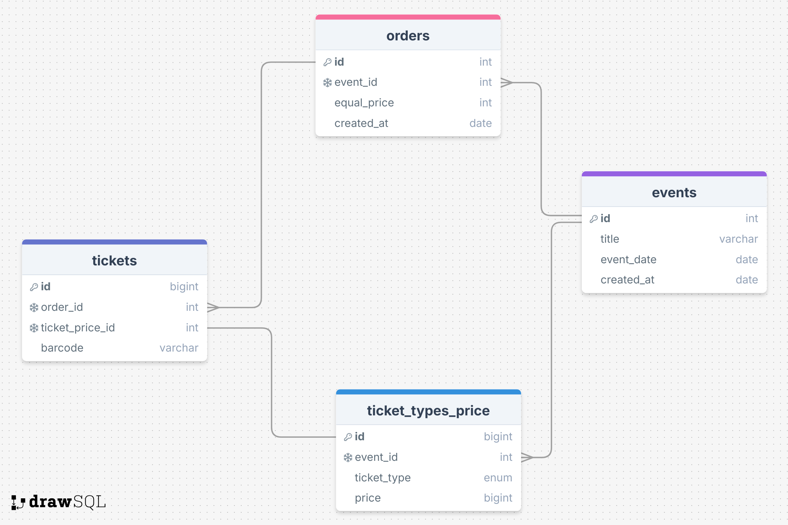

## ТЕСТ ЗАДАНИЕ https://bitbucket.org/nevatrip/test-php/src/master/

<h2 align="center">Задание №1</h2>

### 1) Модель Order и миграция.
### 2) Контроллер OrderController, метод store который содержит всю логику.

<h2 align="center">Задание №2</h2>

    

### Нормализация БД

### Создал отдельную таблицу Ticket_types_price для типов билетов под каждый event, так как у event может быть своя цена для каждого типа билета. Столбец ticket_type имеет тип Enum, если же нужно будет добавить значительное кол-во типов билетов, можно будет создать отдельную таблицу с типами билетов.
### Также была создана таблица Tickets, которая связана с Orders для того чтобы каждый билет имел свой barcode. 
### Добавить индексы: orders.event_id, tickets.order_id
### Ticket_types_price составной индекс на event_id и ticket_type
### Индексы можно пообсуждать, так как недостаточно информации как будет осуществляться поиск по данным.
* events - таблица с какими либо событиями на которое можно купить билет. Имеет связь 1:N к Orders(events.id к orders.event_id), также 1:N к
ticket_types_price. 
* orders - таблица с заказами. Имеет связь 1:N к tickets(orders.id к order_id).
* tickets - таблица отдельно каждого билета, где под каждый билет генерируется свой barcode.
* ticket_types_price - таблица для цен по категориям для каждого event, так как у event может быть разная цена. Имеет
связь 1:1 к Tickets.(ticket_types_price.id к tickets.ticket_price_id)

<h2 align="center">Задание №3</h2>

## Команды для запуска проекта(используется sqlite, для локальной быстрой развертки проекта)
* composer install
* создать копию файла .env.example с названием .env
* php artisan key:generate
* php artisan migrate
* php artisan serve
* endpoint для задачи №1 - (post) /api/order   - параметры (event_id, event_date, ticket_adult_price, ticket_adult_quantity, ticket_kid_price, ticket_kid_quantity)

